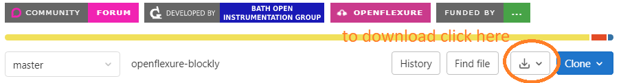

# OpenFlexure Blockly

OpenFlexure Blockly is a graphical way to design scripts for the OpenFlexure Microscope and Delta Stage.  It is built using [Blockly](https://developers.google.com/blockly), Google's open-source visual programming language. Our paper describing our design decisions and how to use OpenFlexure Blockly has been published in [Royal Society Open Science](https://doi.org/10.1098/rsos.221236).

# Using OpenFlexure Blockly

## On the internet (web app)

This is the easiest way to try out OpenFlexure Blockly as it does not require installation. However, you will require an internet connection.

### On your microscope

The web app can be used on your microscope.

1. Open the Web Browser.
2. Open the [web app](https://openflexure.gitlab.io/openflexure-blockly).
3. Connect to `microscope.local`.

### On a computer

The web app can be used to control a microscope on the same network as the computer you are using to connect to the webpage. It requires no installation, but you will need to know the IP address of the microscope, or you can try `microscope.local`.

1. Open the [web app](https://openflexure.gitlab.io/openflexure-blockly).

**Firefox**  
Works by default.

**Chrome**  
You will need to disable the flag [`chrome://flags/#block-insecure-private-network-requests`](chrome://flags/#block-insecure-private-network-requests), although you should only do this if you understand the consequences and change it back afterwards. 

**Edge**  
You will need to disable the flag [`edge://flags/#block-insecure-private-network-requests`](edge://flags/#block-insecure-private-network-requests), although you should only do this if you understand the consequences and change it back afterwards.

## On your computer

After installation you will not need to be connected to the internet, but you will need to be connected to the same network as your microscope.

1. Download this repository.  

1. Extract the compressed files to a folder on your computer 
1. Open `BlocklyExtension/static/index.html` in your browser.

## On your microscope

OpenFlexure Blockly can be installed as an extension on your microscope. After installation it will not need to be connected to the internet. It will then automatically connect to your microscope. To do this:

1. Download this repository.  

1. Save it on your microscope in `/var/openflexure/extensions/microscope_extensions/`.  You may need to [set your user permissions](https://openflexure.gitlab.io/microscope-handbook/develop-extensions/index.html#set-permissions).
1. Restart your microscope.

### Extension

1. Using [OpenFlexure Connect](https://openflexure.org/software/openflexure-connect/), open the Blockly Extension.

### Web app

1. Using [OpenFlexure Connect](https://openflexure.org/software/openflexure-connect/), open the Blockly Extension.
1. Click the `App` button.

# Developing OpenFlexure Blockly
